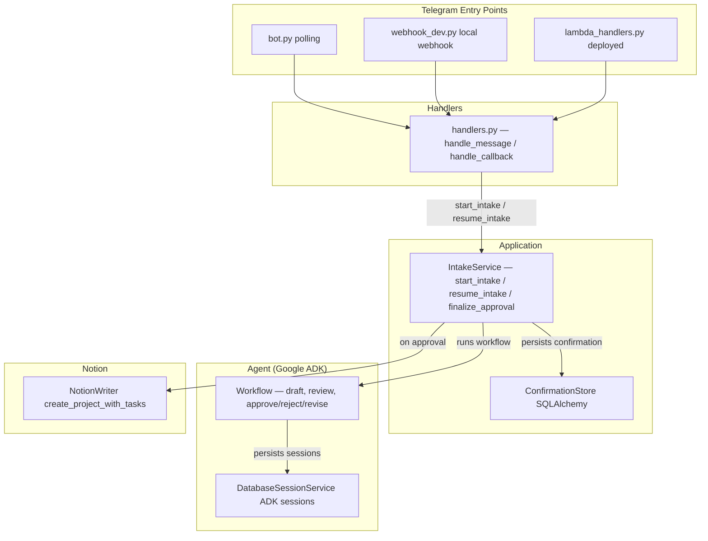

# Architecture Overview

Backlog Tamer is structured in three layers under `src/backlog_tamer/`. Each layer has a clear responsibility and the layers connect through well-defined interfaces.

## Layers

### 1. Agent Layer — `agents/intake_triage/`

The AI triage layer. A Google ADK `Agent` wraps an OpenAI model via LiteLLM and produces a structured `ProjectDraft` as output. The agent is embedded in a `Workflow` graph that implements the human-in-the-loop approval cycle using ADK interrupts.

- **`agent.py`** — defines `draft_agent` (the LLM agent) and `root_agent` (the workflow wrapping the agent). The agent uses `output_schema=ProjectDraft` and `output_key="draft_proposal"` to write structured drafts into session state.
- **`workflow.py`** — builds the ADK `Workflow` graph: `draft → request_human_review → handle_human_review → {approved, rejected, revise}`. The `request_human_review` node emits a `RequestInput` interrupt that pauses execution until the user responds.
- **`prompts.py`** — system instructions, triage prompt templates, review message templates, and revision prompt builder.
- **`schemas.py`** — Pydantic models: `IncomingContext`, `ProjectDraft` (with `topics` and default-empty `tasks`), `FetchedUrl`, `DraftGrounding` (fetch results summary with `is_degraded` property), `SourceLink`, `ReviewDecision`.
- **`tools/fetch_url.py`** — a tool the agent can call to fetch and extract context from web URLs, with SSRF protection and support for HTML, PDF, and X/Twitter oEmbed.

The agent layer is detailed further in [Intake Workflow](../workflows/intake-flow.md).

### 2. Application Layer — `application/`

Orchestration independent of Telegram. `IntakeService` runs the ADK workflow, manages sessions, extracts interrupts from events, and persists confirmation state. It is the bridge between the agent layer and the integrations.

- **`intake_service.py`** — `IntakeService` class with five main methods: `start_intake`, `resume_intake`, `finalize_approval`, `undo_commit`, `add_to_existing_project`. Uses ADK `Runner` + `DatabaseSessionService` for workflow execution. Extracts `adk_request_input` interrupts from event streams to detect when human review is needed. `finalize_approval` performs duplicate detection before writing to Notion.
- **`confirmation_store.py`** — `ConfirmationStore` using SQLAlchemy with a `confirmations` table. Provides `mark_committing_once` as an idempotency lock to prevent duplicate Notion writes (also accepts `FAILED` for retry). Supports `apply_manual_edit` for quick-edit button changes, `mark_duplicate`, `mark_undone`, and `mark_committed` with task IDs.
- **`models.py`** — `ConfirmationRecord` (with `grounding`, `manual_edits`, `notion_task_ids` fields), `ConfirmationStatus` (enum: `PENDING_REVIEW → COMMITTING → COMMITTED / REJECTED / FAILED / UNDONE / DUPLICATE`), `IntakeResult` (with `grounding`, `duplicate_created_time`, `failure_reason` fields).
- **`database_urls.py`** — converts a single `DATABASE_URL` into the sync driver (psycopg/sqlite) for `ConfirmationStore` and the async driver (asyncpg/aiosqlite) for ADK `DatabaseSessionService`. Also provides `uses_external_pooler` and `async_engine_options` for Supabase transaction-pooler compatibility (disables asyncpg statement caching and uses `NullPool`).

### 3. Integrations Layer — `integrations/`

External system connections. Telegram provides three entry points that all share the same handlers; Notion is the write target for approved drafts.

- **`telegram/`** — `bot.py` (local polling), `webhook_dev.py` (local webhook server), `lambda_handlers.py` (deployed: webhook receives and enqueues to SQS, worker dequeues and processes). `handlers.py` contains the shared `handle_message` and `handle_callback` logic, handling approve/reject/revise plus quick edits, refetch, retry, undo, and add-task-to-duplicate. `webhook.py` has `TelegramUpdateProcessor` and webhook validation. `parsing.py` extracts `IncomingContext` from Telegram messages. `rendering.py` builds HTML messages, inline keyboards (review, picker, terminal), and change summaries. `state.py` persists revision state and deduplicates updates, using `NullPool` for external poolers.
- **`notion/writer.py`** — `NotionWriter` creates project pages (with page-body children: bookmark, note, key points, to-do tasks, provenance callout) and task pages in Notion databases. Also performs duplicate detection (`find_project_by_source`), schema fitting (`_fit_to_schema` drops properties missing from the target database), undo (`archive_pages`), and schema health reporting (`describe_schema` for the healthcheck). Sets page icons from resource type, due dates from priority, and topic-based tags.

The integrations are detailed in [Telegram & Notion Integrations](../integrations/telegram-and-notion.md).

## How Layers Connect

*Three-layer architecture: Telegram entry points dispatch through shared handlers to IntakeService, which runs the ADK workflow and writes approved drafts to Notion.*

## Key Design Decisions

- **Human-in-the-loop via ADK interrupts, not chat turns.** The workflow pauses at `request_human_review` by emitting a `RequestInput` interrupt. `IntakeService.resume_intake` replays the user's response into the paused workflow, allowing the agent to route to approved/rejected/revise.
- **Dual database drivers from one URL.** `database_urls.py` derives both sync (for `ConfirmationStore`) and async (for ADK `DatabaseSessionService`) connection strings from a single `DATABASE_URL`, supporting SQLite locally and Postgres/Supabase in production.
- **Idempotent Notion commits.** `mark_committing_once` atomically transitions a confirmation from `PENDING_REVIEW` to `COMMITTING`, preventing duplicate writes if `finalize_approval` is called multiple times.
- **Three Telegram entry points, shared handlers.** All three entry points (`bot.py`, `webhook_dev.py`, `lambda_handlers.py`) build the same `Application` via `build_application` and use the same `handle_message` / `handle_callback` handlers.
- **SQS queue in production.** The Lambda webhook handler validates and enqueues; the Lambda worker handler dequeues and processes. This decouples Telegram's webhook timeout from the potentially slow agent workflow.

## Source References

| File | Purpose |
|------|---------|
| `src/backlog_tamer/agents/intake_triage/agent.py` | Agent and workflow assembly |
| `src/backlog_tamer/agents/intake_triage/workflow.py` | ADK workflow graph definition |
| `src/backlog_tamer/application/intake_service.py` | Core orchestration service |
| `src/backlog_tamer/application/confirmation_store.py` | Confirmation persistence with idempotency |
| `src/backlog_tamer/integrations/telegram/handlers.py` | Shared Telegram message/callback handlers |
| `src/backlog_tamer/integrations/telegram/bot.py` | `build_application` + polling entry point |
| `src/backlog_tamer/integrations/notion/writer.py` | Notion API writer |
| `src/backlog_tamer/config.py` | Settings model (pydantic-settings) |
