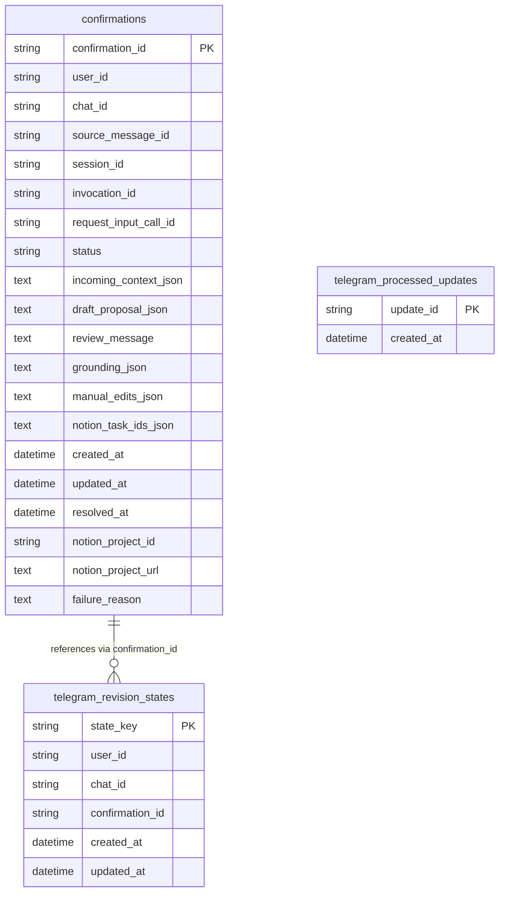

# Data Model

Backlog Tamer uses Pydantic models for agent I/O and internal data transfer, SQLAlchemy tables for durable state, and Notion API payloads for external writes.

## Agent Schemas

All defined in `src/backlog_tamer/agents/intake_triage/schemas.py`.

### IncomingContext

The parsed user input from a Telegram message. Built by `parsing.py` from Telegram `Message` entities.

| Field | Type | Notes |
|-------|------|-------|
| `raw_text` | `str` | Full message text or caption, min length 1 |
| `note` | `str \| None` | Text with URLs stripped out |
| `links` | `list[SourceLink]` | Deduplicated URLs from message entities and text links |

### ProjectDraft

The agent's structured output. Written to session state under key `draft_proposal` and persisted as JSON in the `confirmations` table.

| Field | Type | Notes |
|-------|------|-------|
| `project_name` | `str` | Min length 1 (never bare names) |
| `summary` | `str` | 1–600 chars |
| `resource_type` | `Literal` | `article`, `paper`, `video`, `course`, `documentation`, `repository`, `idea`, `unknown` |
| `intent` | `Literal` | `learn`, `build`, `research`, `explore`, `reference`, `unclear` |
| `priority` | `Literal` | `Low`, `Medium`, `High` |
| `source_url` | `str \| None` | Original URL if available |
| `topics` | `list[str]` | Up to 3 topic tags; carried into the Notion Tags property instead of restating type/intent |
| `tasks` | `list[str]` | Defaults to empty list; up to 5 if user requests breakdown |

### FetchedUrl

Result of the `fetch_url` tool. Stored in session state under `fetched_context`.

| Field | Type | Notes |
|-------|------|-------|
| `status` | `Literal["success", "error"]` | |
| `requested_url` | `str` | Original URL passed to tool |
| `final_url` | `str \| None` | After redirects |
| `canonical_url` | `str \| None` | From `<link rel="canonical">` |
| `domain` | `str \| None` | |
| `page_kind` | `Literal` | `html`, `pdf`, `text`, `unknown` |
| `title`, `description`, `site_name`, `author`, `published_at` | `str \| None` | Extracted metadata |
| `key_points` | `list[str]` | Up to 5 extracted points |
| `content_preview` | `str \| None` | Max 1600 chars |
| `notes` | `list[str]` | Additional extracted notes |
| `error` | `str \| None` | Error reason if status is error |

### DraftGrounding

A compact summary of what the fetch tool learned, persisted alongside the draft so the review card and Notion page can show confidence and key points. Defined in `schemas.py`.

| Field | Type | Notes |
|-------|------|-------|
| `fetch_status` | `Literal["success", "error", "skipped"]` | Defaults to `"skipped"` |
| `fetch_error` | `str \| None` | Error reason if fetch failed |
| `site_name` | `str \| None` | From fetched page metadata |
| `page_title` | `str \| None` | From fetched page |
| `canonical_url` | `str \| None` | Used for duplicate detection |
| `key_points` | `list[str]` | Up to 4 points, surfaced in Notion page body |

The `is_degraded` property returns `True` when `fetch_status == "error"`, which triggers a fetch-warning footer on the review card and a "Retry fetch" button.

## Application Models

Defined in `src/backlog_tamer/application/models.py`.

### ConfirmationStatus

```python
class ConfirmationStatus(StrEnum):
    PENDING_REVIEW = "pending_review"
    COMMITTING = "committing"
    COMMITTED = "committed"
    REJECTED = "rejected"
    FAILED = "failed"
    UNDONE = "undone"
    DUPLICATE = "duplicate"
```

`FAILED` is retryable — `mark_committing_once` accepts `FAILED` as a valid source state, so the user can retry the Notion write without re-running the agent. `UNDONE` means the Notion pages were archived after a successful commit (via the undo button). `DUPLICATE` means a project with the same source URL already exists in Notion.

### ConfirmationRecord

The full state of an intake item, persisted in the `confirmations` table.

| Field | Type | Notes |
|-------|------|-------|
| `confirmation_id` | `str` | UUID, primary key |
| `user_id` | `str` | Telegram user ID |
| `chat_id` | `str \| None` | Telegram chat ID |
| `source_message_id` | `str \| None` | Telegram message ID |
| `session_id` | `str` | ADK session ID |
| `invocation_id` | `str` | ADK invocation ID (for resume) |
| `request_input_call_id` | `str` | ADK function call ID (for resume) |
| `status` | `ConfirmationStatus` | Current lifecycle state |
| `incoming_context` | `IncomingContext` | Original user input |
| `draft_proposal` | `ProjectDraft` | Latest draft |
| `grounding` | `DraftGrounding` | What the fetch tool learned (fetch status, key points, etc.) |
| `manual_edits` | `dict[str, str]` | Fields the user changed via inline keyboard pickers; replayed into revision so the agent does not undo them |
| `review_message` | `str` | Human-readable review prompt |
| `created_at`, `updated_at` | `datetime` | Timestamps |
| `resolved_at` | `datetime \| None` | Set when terminal |
| `notion_project_id` | `str \| None` | Notion page ID after commit |
| `notion_project_url` | `str \| None` | Notion page URL after commit |
| `notion_task_ids` | `list[str]` | Notion task page IDs after commit |
| `failure_reason` | `str \| None` | Error details if FAILED |

### IntakeResult

The return type from `IntakeService` methods, consumed by Telegram handlers.

| Field | Type | Notes |
|-------|------|-------|
| `status` | `str` | Lifecycle status string |
| `confirmation_id` | `str \| None` | |
| `draft_proposal` | `ProjectDraft \| None` | |
| `grounding` | `DraftGrounding` | Fetch tool results summary |
| `review_message` | `str \| None` | |
| `notion_project_url` | `str \| None` | |
| `duplicate_created_time` | `str \| None` | When the existing duplicate was created (for DUPLICATE status) |
| `failure_reason` | `str \| None` | Error details if FAILED |

## Database Tables

### `confirmations` (ConfirmationStore)

Defined in `src/backlog_tamer/application/confirmation_store.py`. Uses SQLAlchemy ORM. JSON fields store `IncomingContext` and `ProjectDraft` as serialized strings.

### `telegram_revision_states` (TelegramStateStore)

Defined in `src/backlog_tamer/integrations/telegram/state.py`. Tracks which confirmation a user is currently revising per chat.

| Column | Type | Notes |
|--------|------|-------|
| `state_key` | `String(255)` | PK, composite of user_id + chat_id |
| `user_id` | `String(255)` | |
| `chat_id` | `String(255)` | |
| `confirmation_id` | `String(64)` | Which draft is being revised |
| `created_at`, `updated_at` | `DateTime` | |

### `telegram_processed_updates` (TelegramStateStore)

Deduplication table for Lambda worker. Prevents processing the same Telegram update twice if SQS delivers duplicates.

| Column | Type | Notes |
|--------|------|-------|
| `update_id` | `String(64)` | PK, Telegram update_id |
| `created_at` | `DateTime` | |

## Entity Relationships



## Notion Payload Structure

`NotionWriter` (`src/backlog_tamer/integrations/notion/writer.py`) builds two types of Notion page payloads. It also performs duplicate detection, schema fitting, and undo (archival).

### Project Page

Created in the projects database with:
- **Project name** (title): `draft.project_name`
- **Status** (status): `"Backlog"` (fixed default)
- **Priority** (select): `draft.priority`
- **Type** (select): `draft.resource_type`
- **Intent** (select): `draft.intent`
- **Tags** (multi_select): derived from `draft.topics`
- **Captured** (date): today's date
- **Summary** (rich_text): `draft.summary`
- **Source** (url): `draft.source_url` if present
- **Icon**: emoji mapped from `resource_type`
- **Children** (page body): bookmark block for the source URL, "Why I saved this" heading with the user's note, "Key points" from grounding (if available), "Next action" to-do blocks for tasks, and a provenance callout. No `template` is sent on project pages because Notion rejects a page that sends both a template and children.
- Optional properties (Source, Type, Intent, Captured) are silently dropped if the database does not have them yet, via `_fit_to_schema`.

### Task Page

Created in the tasks database for each entry in `draft.tasks`:
- **Task name** (title): task name string
- **Status** (status): `"Not started"` (fixed default)
- **Priority** (select): inherited from project draft priority
- **Projects** (relation): `[{id: project_id}]` linking back to the created project page
- **Due** (date): computed from priority — High = +3 days, Medium = +14 days, Low = none
- **Source** (url): `draft.source_url` if present
- Uses `template: {type: "default"}`
- Optional properties (Due, Source) are silently dropped if missing from the database.

## Source References

| File | Purpose |
|------|---------|
| `src/backlog_tamer/agents/intake_triage/schemas.py` | `IncomingContext`, `ProjectDraft`, `FetchedUrl`, `DraftGrounding`, `SourceLink`, `ReviewDecision` |
| `src/backlog_tamer/application/models.py` | `ConfirmationRecord`, `ConfirmationStatus`, `IntakeResult` |
| `src/backlog_tamer/application/confirmation_store.py` | `ConfirmationRow` ORM, `confirmations` table |
| `src/backlog_tamer/integrations/telegram/state.py` | `TelegramRevisionRow`, `TelegramUpdateRow` ORM |
| `src/backlog_tamer/integrations/notion/writer.py` | Notion page payload builders |
