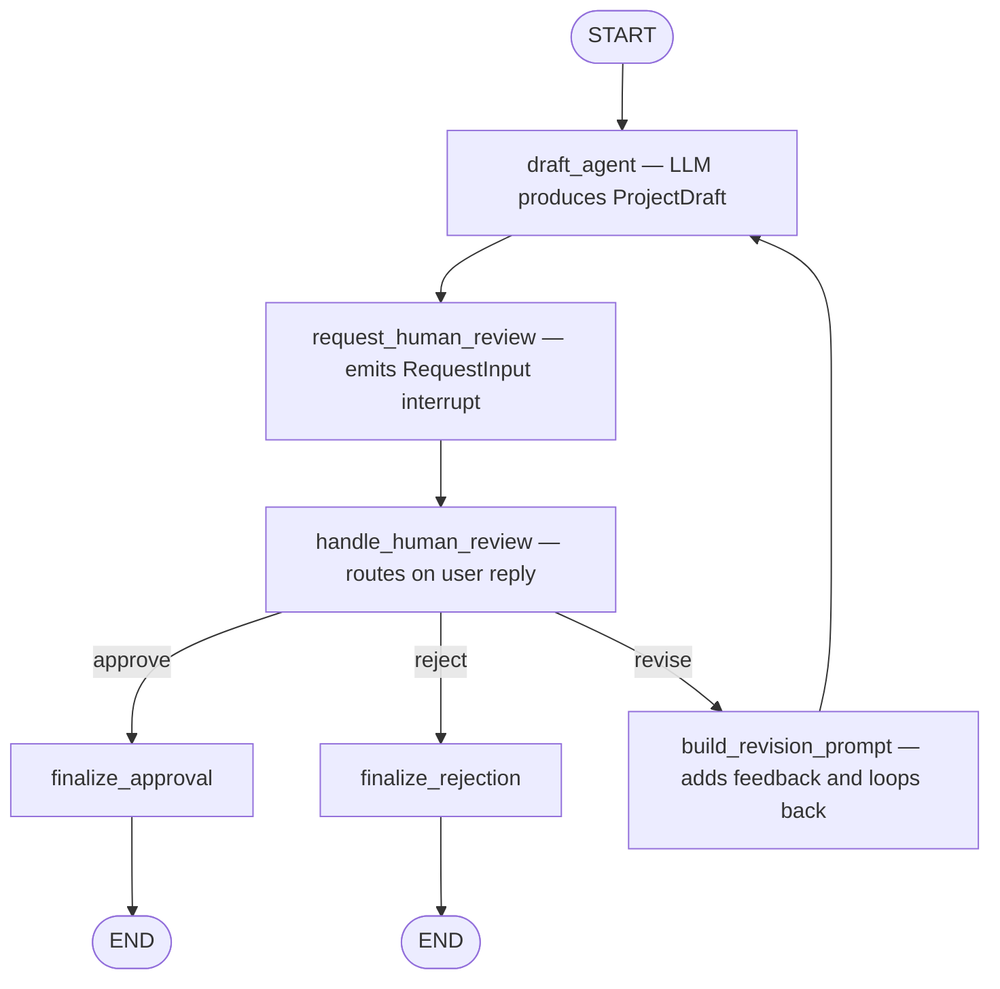
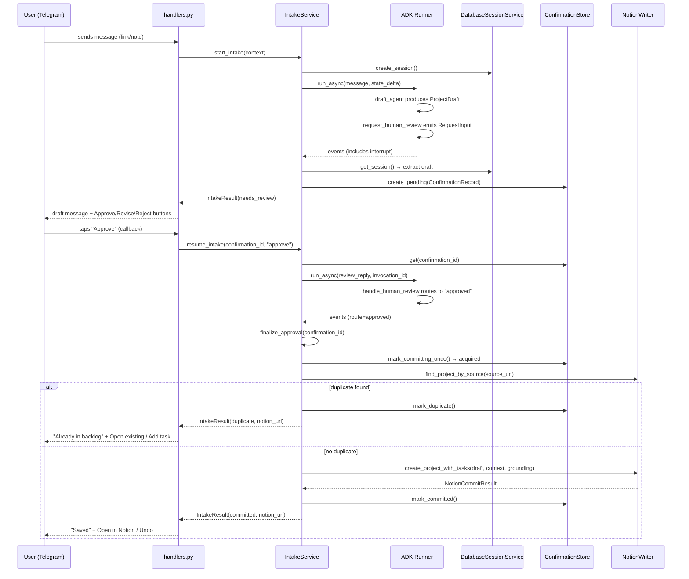
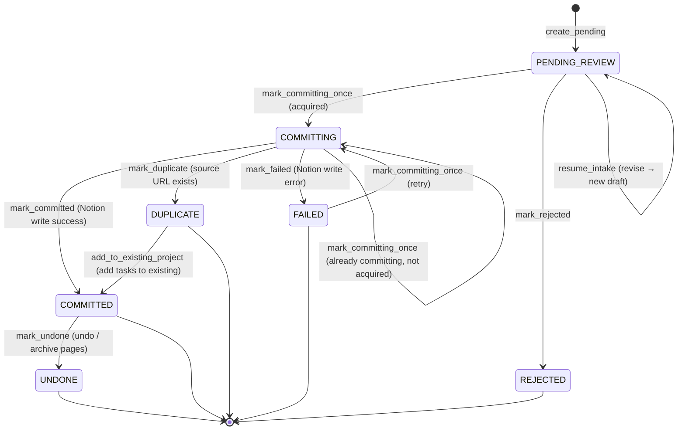

# Intake Workflow

The intake workflow is the core product loop. It takes a raw Telegram message, runs it through an AI agent that produces a structured draft, pauses for human review, and either commits the draft to Notion, rejects it, or loops back for revision.

## ADK Workflow Graph

The workflow is defined in `src/backlog_tamer/agents/intake_triage/workflow.py` using Google ADK's `Workflow` class. The graph has three node types and three routes:

*ADK workflow graph: the agent drafts a proposal, pauses for human review, and routes to approval, rejection, or revision with a feedback loop.*

### Workflow Nodes

| Node | File | Behavior |
|------|------|----------|
| `draft_agent` | `agent.py` | LLM agent with `output_schema=ProjectDraft`, `output_key="draft_proposal"`. Can call `fetch_url` tool. |
| `request_human_review` | `workflow.py` | Coerces draft, builds snapshot, emits `RequestInput` interrupt with `interrupt_id="human_review"`. |
| `handle_human_review` | `workflow.py` | Normalizes feedback: "approve" → route `approved`, "reject" → route `rejected`, anything else → route `revise` with feedback in state. |
| `finalize_approval` | `workflow.py` | Returns a terminal string. Actual Notion write happens in `IntakeService.finalize_approval`. |
| `finalize_rejection` | `workflow.py` | Returns a terminal string. |
| `build_revision_prompt` | `prompts.py` | Constructs a revision prompt from latest feedback, current draft snapshot, original intake, and prior review history. Loops back to `draft_agent`. |

### Session State Keys

| Key | Set By | Contains |
|-----|--------|----------|
| `triage_input` | `build_triage_state_delta` | The formatted triage prompt text |
| `draft_proposal` | `draft_agent` (output_key) | The `ProjectDraft` dict |
| `draft_snapshot` | `request_human_review` | Human-readable snapshot of the draft |
| `review_feedback` | `handle_human_review` (on revise) | Latest free-form feedback text |
| `review_history` | `handle_human_review` (on revise) | List of all feedback rounds |
| `fetched_context` | `fetch_url` tool | Dict of URL → `FetchedUrl` result |
| `manual_edits` | `ConfirmationStore.apply_manual_edit` | Fields the user changed via quick-edit buttons |

## End-to-End Request Flow

The `IntakeService` (`src/backlog_tamer/application/intake_service.py`) orchestrates the workflow across multiple interactions. Before drafting, `start_intake` loads the workspace's existing Notion tag vocabulary via `IntakeService._known_topics()` → `NotionWriter.list_tag_options()` and passes it as `known_topics` into `build_triage_prompt`, so the agent reuses an existing tag spelling instead of minting a near-duplicate. The tag lookup is best-effort and never blocks a capture if Notion is unreachable.

### Revision Flow

When the user taps "Revise", `handlers.py` stores the `confirmation_id` in `TelegramStateStore` and prompts the user to send free-text feedback. When the user sends a text message, `handle_message` detects the pending revision and calls `resume_intake` with the feedback text. The workflow routes to `revise`, which builds a revision prompt and loops back to `draft_agent`. The agent re-runs, produces a new `ProjectDraft`, and `request_human_review` emits a new interrupt — starting the review cycle again.

If the user has made any quick-edit button changes before revising, `_with_manual_edits` prepends them to the review reply so the agent preserves those corrections instead of undoing them.

### Quick Edits (No Agent Re-run)

The user can change priority, intent, or project type directly from the review keyboard without re-running the agent. Tapping a field button (`edit:p:{id}`, `edit:i:{id}`, `edit:t:{id}`) swaps the keyboard for a picker of options. Picking an option calls `ConfirmationStore.apply_manual_edit`, which patches the stored draft in place and records the change in `manual_edits` as a `ManualEdit(before=..., after=...)` pair. The `before` value is the agent's original answer and is kept stable across repeated taps on the same field, so a correction stays measurable. The review card re-renders with the updated value.

A legacy `resource_type` value picked on an in-flight draft is normalized to the new `project_type` vocabulary through `LEGACY_RESOURCE_TYPE_TO_PROJECT_TYPE`, and rows persisted under the old `resource_type` key are migrated to `project_type` on load.

### Task Name Composition

Before the draft is shown to anyone, `IntakeService._try_extract_draft_from_state` runs `with_composed_task_names` (in `src/backlog_tamer/agents/intake_triage/task_names.py`) so the review card, Telegram, and Notion all show the same task names. The default task — a single task carrying only a bare verb like `"Read"` or `"Explore"` — is rewritten to `"<verb>: <short_name>"`. The verb is a mechanical function of intent (`learn`→Read, `explore`→Explore, `build`→Build, `research`→Research, `reference`→"Skim and file", `unclear`→Explore), overridden by project type (`course`→"Work through", `video`→Watch). The subject is `draft.effective_short_name`.

The rewrite is idempotent and narrow by design: a name that already reads `"<verb>: <subject>"` is returned unchanged, multi-task breakdowns are left alone, and authored names (anything not a bare verb) are never overwritten. This moved task naming out of the prompt — where the same rule had produced `"Explore"` for one course and `"Read"` for another — into deterministic code.

### Refetch After Failed Page Fetch

When the fetch tool fails, the review card shows a warning and a "Retry fetch" button. Tapping it clears the `fetch_url` cache (so the cached failure is not returned again) and re-runs `resume_intake` with a "fetch the source URL again" instruction, producing a new draft from fresh page content.

### Duplicate Detection

Before creating a new project, `finalize_approval` calls `NotionWriter.find_project_by_source` with the draft's canonical URL (from grounding) or source URL. `NotionWriter` stores the canonical URL via `commit_source_url(draft, grounding)` (preferring `grounding.canonical_url` over `draft.source_url`), and `fetch_url` strips campaign parameters (`utm_*`, `fbclid`, `gclid`, etc.) from the normalized URL, so a re-capture of the same page through a different tracking link can match the earlier row. If an existing project with that URL is found, the confirmation is marked `DUPLICATE` instead of `COMMITTED`, and the user is offered "Open existing" and "Add task there" buttons. Choosing "Add task there" calls `IntakeService.add_to_existing_project`, which attaches the draft's tasks to the existing project page.

### Undo

After a successful commit, the user can tap "Undo" to archive the Notion pages (project + tasks) via `NotionWriter.archive_pages`. The confirmation transitions from `COMMITTED` to `UNDONE`, and the Notion page IDs are cleared from the record.

### Correction Signal at Approval

`finalize_approval` calls `IntakeService._log_corrections`, which emits one structured `intake_correction` log line per approval listing each field where the user moved the agent off its answer (`{field: {agent: before, user: after}}`). Quick edits run no model and emit no trace, so without this line a week of hand-corrections reads as a clean approval rate. The signal comes from `ConfirmationRecord.corrected_fields`, the subset of `manual_edits` where `before` is non-empty and differs from `after`.

### Failed Save and Retry

If `create_project_with_tasks` raises, the confirmation is marked `FAILED` with the error string in `failure_reason`. The user sees the full draft and a "Retry save" button. `mark_committing_once` accepts `FAILED` as a valid source state, so retrying does not require re-running the agent — only the Notion write is repeated.

## Confirmation Lifecycle

`ConfirmationRecord` tracks the state of each intake item. The status transitions are enforced by `ConfirmationStore`:

### Idempotency

`mark_committing_once` is the critical idempotency guard. It atomically transitions a record from `PENDING_REVIEW` or `FAILED` to `COMMITTING` and returns `acquired=True`. If the record is already `COMMITTING` or `COMMITTED`, it returns `acquired=False` — meaning another call is already in progress or has completed. `finalize_approval` checks this before writing to Notion, preventing duplicate writes from duplicate webhook deliveries or concurrent Lambda invocations. The `FAILED` → `COMMITTING` transition enables retry without re-running the agent.

## Dev Workflow Runner

`src/backlog_tamer/dev/run_intake_workflow.py` runs the ADK workflow standalone with `InMemorySessionService`, without Telegram or database persistence. It accepts raw text, notes, and links as CLI arguments, and can optionally auto-resume the review interrupt with a `--review-reply` flag. This is useful for iterating on prompts and schemas without setting up the full stack.

## Source References

| File | Purpose |
|------|---------|
| `src/backlog_tamer/agents/intake_triage/workflow.py` | ADK workflow graph, node functions, state keys; `build_triage_message`/`build_triage_state_delta` thread `known_topics` |
| `src/backlog_tamer/agents/intake_triage/prompts.py` | All prompt templates and builders; `build_triage_prompt` injects the existing tag vocabulary (`MAX_KNOWN_TOPICS`) |
| `src/backlog_tamer/agents/intake_triage/task_names.py` | `compose_task_names`, `with_composed_task_names` — default task naming |
| `src/backlog_tamer/application/intake_service.py` | `start_intake`, `resume_intake`, `finalize_approval`, `undo_commit`, `add_to_existing_project`, `_known_topics`, `_log_corrections` |
| `src/backlog_tamer/application/confirmation_store.py` | `mark_committing_once` and all status transitions |
| `src/backlog_tamer/application/models.py` | `ConfirmationStatus` enum |
| `src/backlog_tamer/dev/run_intake_workflow.py` | Standable workflow runner for dev |
