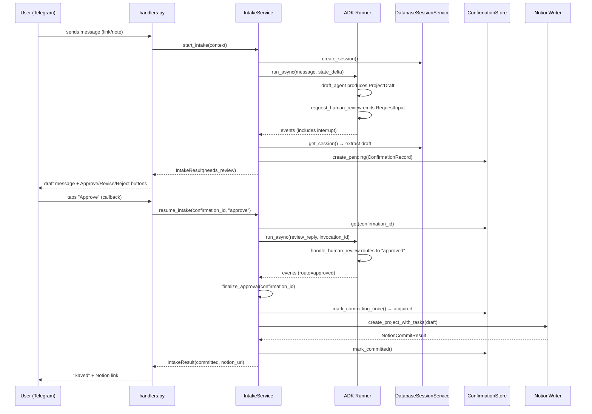
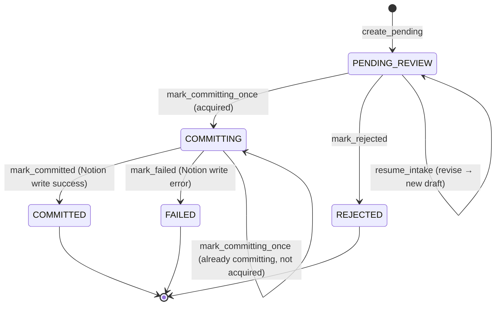

# Intake Workflow

The intake workflow is the core product loop. It takes a raw Telegram message, runs it through an AI agent that produces a structured draft, pauses for human review, and either commits the draft to Notion, rejects it, or loops back for revision.

## ADK Workflow Graph

The workflow is defined in `src/backlog_tamer/agents/intake_triage/workflow.py` using Google ADK's `Workflow` class. The graph has three node types and three routes:

<!-- openwiki: mermaid parse failed and this diagram was converted to a text fence so it does not break rendering. Fix the diagram source and restore the mermaid fence. Parser error: Heuristic: an unescaped angle bracket inside a label breaks rendering; rephrase the label. -->
```text
flowchart TD
    START([START]) --> DA["draft_agent<br/>(LLM produces ProjectDraft)"]
    DA --> RHR["request_human_review<br/>(emits RequestInput interrupt)"]
    RHR --> HHR["handle_human_review<br/>(routes on user reply)"]
    HHR -->|"approve"| FA["finalize_approval"]
    HHR -->|"reject"| FR["finalize_rejection"]
    HHR -->|"revise"| BRP["build_revision_prompt<br/>(adds feedback + loops back)"]
    BRP --> DA
    FA --> END1([END])
    FR --> END2([END])
```

### Workflow Nodes

| Node | File | Behavior |
|------|------|----------|
| `draft_agent` | `agent.py` | LLM agent with `output_schema=ProjectDraft`, `output_key="draft_proposal"`. Can call `fetch_url` tool. |
| `request_human_review` | `workflow.py` | Coerces draft, builds snapshot, emits `RequestInput` interrupt with `interrupt_id="human_review"`. |
| `handle_human_review` | `workflow.py` | Normalizes feedback: "approve" → route `approved`, "reject" → route `rejected`, anything else → route `revise` with feedback in state. |
| `finalize_approval` | `workflow.py` | Returns a terminal string. Actual Notion write happens in `IntakeService.finalize_approval`. |
| `finalize_rejection` | `workflow.py` | Returns a terminal string. |
| `build_revision_prompt` | `prompts.py` | Constructs a revision prompt from latest feedback, current draft snapshot, original intake, and prior review history. Loops back to `draft_agent`. |

### Session State Keys

| Key | Set By | Contains |
|-----|--------|----------|
| `triage_input` | `build_triage_state_delta` | The formatted triage prompt text |
| `draft_proposal` | `draft_agent` (output_key) | The `ProjectDraft` dict |
| `draft_snapshot` | `request_human_review` | Human-readable snapshot of the draft |
| `review_feedback` | `handle_human_review` (on revise) | Latest free-form feedback text |
| `review_history` | `handle_human_review` (on revise) | List of all feedback rounds |
| `fetched_context` | `fetch_url` tool | Dict of URL → `FetchedUrl` result |

## End-to-End Request Flow

The `IntakeService` (`src/backlog_tamer/application/intake_service.py`) orchestrates the workflow across multiple interactions:



### Revision Flow

When the user taps "Revise", `handlers.py` stores the `confirmation_id` in `TelegramStateStore` and prompts the user to send free-text feedback. When the user sends a text message, `handle_message` detects the pending revision and calls `resume_intake` with the feedback text. The workflow routes to `revise`, which builds a revision prompt and loops back to `draft_agent`. The agent re-runs, produces a new `ProjectDraft`, and `request_human_review` emits a new interrupt — starting the review cycle again.

## Confirmation Lifecycle

`ConfirmationRecord` tracks the state of each intake item. The status transitions are enforced by `ConfirmationStore`:



### Idempotency

`mark_committing_once` is the critical idempotency guard. It atomically transitions a record from `PENDING_REVIEW` to `COMMITTING` and returns `acquired=True`. If the record is already `COMMITTING` or `COMMITTED`, it returns `acquired=False` — meaning another call is already in progress or has completed. `finalize_approval` checks this before writing to Notion, preventing duplicate writes from duplicate webhook deliveries or concurrent Lambda invocations.

## Dev Workflow Runner

`src/backlog_tamer/dev/run_intake_workflow.py` runs the ADK workflow standalone with `InMemorySessionService`, without Telegram or database persistence. It accepts raw text, notes, and links as CLI arguments, and can optionally auto-resume the review interrupt with a `--review-reply` flag. This is useful for iterating on prompts and schemas without setting up the full stack.

## Source References

| File | Purpose |
|------|---------|
| `src/backlog_tamer/agents/intake_triage/workflow.py` | ADK workflow graph, node functions, state keys |
| `src/backlog_tamer/agents/intake_triage/prompts.py` | All prompt templates and builders |
| `src/backlog_tamer/application/intake_service.py` | `start_intake`, `resume_intake`, `finalize_approval` |
| `src/backlog_tamer/application/confirmation_store.py` | `mark_committing_once` and all status transitions |
| `src/backlog_tamer/application/models.py` | `ConfirmationStatus` enum |
| `src/backlog_tamer/dev/run_intake_workflow.py` | Standable workflow runner for dev |
